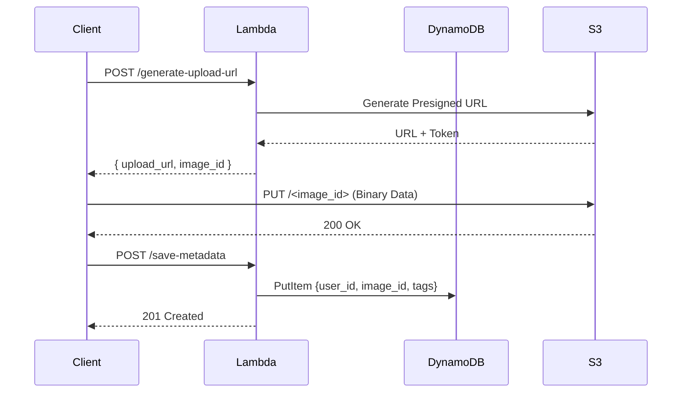
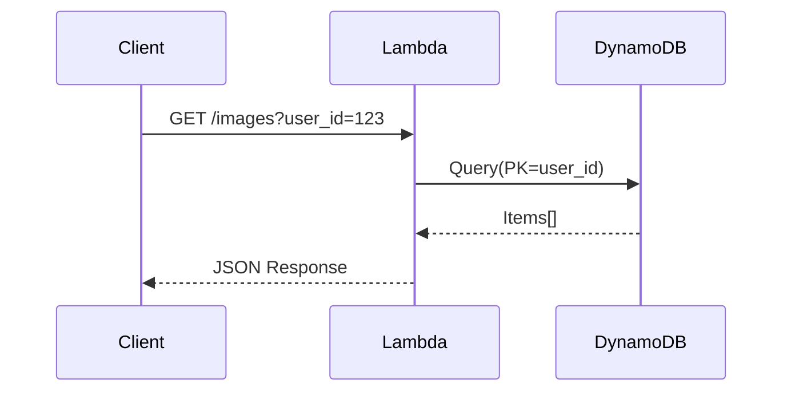

# System Architecture

## Overview
This service provides a serverless backend for secure image uploads and metadata management, coupled with a high-performance React frontend.

## High-Level Diagram

```mermaid
graph TD
    User[User/Client] -->|HTTPS| CF[CloudFront/CDN]
    CF -->|Static Assets| S3Web[S3 Bucket (Frontend)]
    CF -->|API Requests| APIG[API Gateway]
    
    subgraph Backend [Serverless Backend]
        APIG -->|Trigger| Lambda[AWS Lambda Functions]
        Lambda -->|Get Presigned URL| S3Img[S3 Bucket (Images)]
        Lambda -->|Read/Write| DDB[DynamoDB Table]
    end
    
    User -->|Direct Upload (PUT)| S3Img
```

## Data Flow

### 1. Image Upload Flow


### 2. Image Retrieval Flow


## Component Details

### Frontend
- **Framework**: React + Vite
- **Styling**: Tailwind CSS + Framer Motion
- **Hosting**: S3 Static Website Hosting behind CloudFront

### Backend
- **Compute**: AWS Lambda (Python 3.8+)
- **API**: Amazon API Gateway (REST API)
- **Storage**: Amazon S3 (Binary Objects)
- **Database**: Amazon DynamoDB (Metadata)

### Database Schema
**Table: ImageMetadata**
- **PK**: `user_id` (String)
- **SK**: `image_id` (String, ISO Timestamp)
- **GSI1**: `tag-index` (PK: `tag`, SK: `image_id`)
